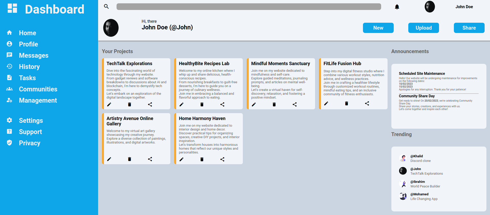

# Admin-Dashboard
Live demo &#128073; https://masecurity.github.io/Admin-Dashboard/
## What is this project about?
This project is about creating an Admin dashboard for a project-based community, using HTML and CSS.

## What i learned
- CSS Grid
- Positioning Grid Elements
- Advanced Grid Properties such as (auto-fit, min, max, fractional units (1fr..)) and so on.
